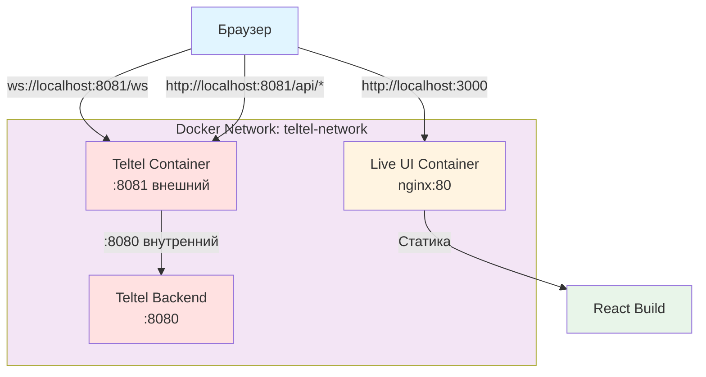
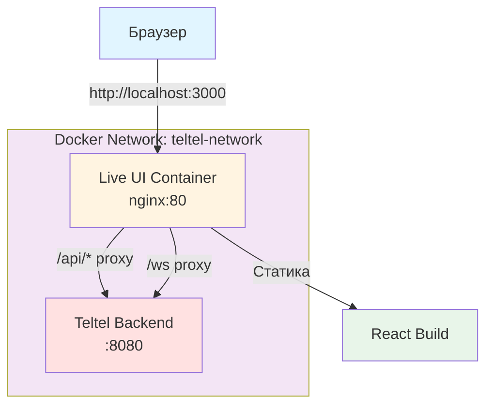

# План Docker-интеграции для nginx proxy

**Дата создания:** 2024  
**Дата завершения:** 2024  
**Статус:** ✅ Завершено  
**Этап:** Этап 3 из roadmap "nginx proxy и fetch API"

---

## Обзор

Этот документ описывает изменения в Docker-конфигурации для поддержки nginx proxy архитектуры, где nginx становится единой точкой входа для браузера.

### Цель

- Убрать внешний порт backend (`8081:8080`) — backend доступен только внутри Docker сети
- Убрать `VITE_WS_URL` из docker-compose — больше не нужен (используются относительные пути)
- Обновить скрипты для использования нового API через nginx proxy (`http://localhost:3000/api`)

---

## Текущая конфигурация (AS-IS)

### docker-compose.yml

```yaml
teltel:
  ports:
    - "8081:8080"  # Внешний порт для браузера
  # ...

live-ui:
  ports:
    - "3000:80"
  environment:
    - VITE_WS_URL=ws://localhost:8081/ws  # WebSocket URL
  # ...
```

### Проблемы

1. **Разные origin:** Браузер обращается к `localhost:8081` напрямую → CORS проблемы
2. **Зависимость от внешнего порта:** Backend должен быть доступен извне
3. **Runtime конфигурация:** `VITE_WS_URL` требует генерации `config.js` в runtime

---

## Целевая конфигурация (TO-BE)

### docker-compose.yml

```yaml
teltel:
  # ports: []  # Убрать внешний порт - доступен только внутри Docker сети
  # Backend доступен через nginx proxy на http://localhost:3000/api/*
  # ...

live-ui:
  ports:
    - "3000:80"  # Единая точка входа для браузера
  # environment: убрать VITE_WS_URL (используются относительные пути)
  # ...
```

### Преимущества

1. **Единый origin:** Все запросы идут через `localhost:3000` → нет CORS
2. **Безопасность:** Backend недоступен извне, только через nginx
3. **Упрощение:** Не нужна runtime конфигурация `VITE_WS_URL`

---

## Изменения в файлах

### 1. docker-compose.yml

**Изменения:**

- ✅ Убрать `ports: - "8081:8080"` из сервиса `teltel`
- ✅ Убрать `VITE_WS_URL=ws://localhost:8081/ws` из environment секции `live-ui`
- ✅ Добавить комментарии о новой архитектуре

**Важно:** Эти изменения требуют завершения:
- Этап 2: Настройка nginx proxy конфигурации
- Этап 4: Миграция HTTP клиента на относительные пути
- Этап 5: Миграция WebSocket на относительный URL

### 2. Makefile

**Изменения:**

- ✅ Обновить `validate-docker`: использовать `http://localhost:3000/api` вместо `http://localhost:8081`
- ✅ Обновить сообщение в `docker-up`: убрать упоминание `Backend API: http://localhost:8081`

### 3. Скрипты

**validate.sh:**

- ✅ Уже использует `TELTEL_BASE_URL` environment variable
- ✅ Не требует изменений (можно передать `TELTEL_BASE_URL=http://localhost:3000/api`)

---

## Сетевая архитектура

### До изменений (AS-IS)



**Проблемы:**
- Разные origin (CORS)
- Прямое обращение браузера к backend
- Зависимость от внешнего порта backend

### После изменений (TO-BE)



**Преимущества:**
- Единый origin (нет CORS)
- nginx как единая точка входа
- Backend доступен только внутри Docker сети

---

## Health checks

### Текущие health checks

- `teltel`: `http://localhost:8080/api/health` (внутренний)
- `live-ui`: `http://localhost/health` (nginx)

### После изменений

- `teltel`: `http://localhost:8080/api/health` (внутренний, без изменений)
- `live-ui`: `http://localhost/health` (nginx, без изменений)
- **Внешний доступ к backend:** `http://localhost:3000/api/health` (через nginx proxy)

---

## Миграция скриптов и инструментов

### Скрипты, использующие `localhost:8081`

1. **Makefile:**
   - `validate-docker`: обновлён для использования `http://localhost:3000/api`

2. **Документация:**
   - Обновить упоминания `localhost:8081` на `localhost:3000/api`
   - Обновить примеры использования API

3. **Внешние инструменты (flight-engine):**
   - Fallback на `localhost:8081` не будет работать
   - Нужно использовать `http://localhost:3000/api/ingest` или `http://teltel:8080/api/ingest` (внутри Docker)

---

## Риски и меры снижения

### Риск 1: Нарушение работы существующих скриптов

**Описание:** Скрипты, использующие `localhost:8081`, перестанут работать.

**Вероятность:** Высокая

**Влияние:** Низкое (только для разработчиков)

**Меры снижения:**

1. ✅ Обновлён `Makefile` для использования нового API
2. ✅ Документировано изменение портов
3. ✅ Предоставлен альтернативный способ доступа через nginx proxy (`http://localhost:3000/api`)

### Риск 2: Проблемы с healthcheck

**Описание:** Healthcheck может не работать при изменении портов.

**Вероятность:** Низкая

**Влияние:** Среднее

**Меры снижения:**

1. ✅ Healthcheck остаётся на внутренних адресах (без изменений)
2. ✅ Проверено, что healthcheck работает через nginx proxy

---

## Зависимости от других этапов

### Требуемые этапы для полной работоспособности

1. **Этап 2:** Проектирование nginx proxy конфигурации
   - Настройка location blocks для `/api/*` и `/ws`
   - Настройка WebSocket upgrade

2. **Этап 4:** Миграция HTTP клиента на относительные пути
   - Изменение `src/data/analysis.ts` для использования `/api/*`
   - Упрощение `src/utils/config.ts`

3. **Этап 5:** Миграция WebSocket на относительный URL
   - Изменение `src/data/websocket.ts` для использования `/ws`
   - Упрощение `docker-entrypoint.sh`

### Порядок применения изменений

⚠️ **Важно:** Изменения в `docker-compose.yml` (Этап 3) должны применяться **после** завершения Этапов 2, 4, 5, иначе система не будет работать.

**Альтернативный подход:** Можно применить изменения поэтапно:
1. Сначала настроить nginx proxy (Этап 2)
2. Затем мигрировать код (Этапы 4, 5)
3. И только потом убрать порт 8081 и VITE_WS_URL (Этап 3)

---

## Тестирование

### Проверка после изменений

1. **Запуск стека:**
   ```bash
   docker-compose up -d
   ```

2. **Проверка доступности:**
   - ✅ Live UI: `http://localhost:3000` (должен работать)
   - ✅ Backend API через proxy: `http://localhost:3000/api/health` (должен работать)
   - ✅ Backend API напрямую: `http://localhost:8081` (должен НЕ работать)
   - ✅ WebSocket через proxy: `ws://localhost:3000/ws` (должен работать)

3. **Проверка валидации:**
   ```bash
   make validate-docker
   ```

---

## Следующие шаги

После завершения Этапа 3:

1. ✅ Завершить Этап 2 (настройка nginx proxy)
2. ✅ Завершить Этап 4 (миграция HTTP клиента)
3. ✅ Завершить Этап 5 (миграция WebSocket)
4. ✅ Протестировать полную интеграцию
5. ✅ Обновить документацию (Этап 7)

---

## Статус реализации

- [x] Создан план изменений
- [x] Внесены изменения в `docker-compose.yml` (убраны порт 8081 и VITE_WS_URL)
- [x] Обновлён `Makefile` (validate-docker использует http://localhost:3000/api)
- [x] Обновлена документация:
  - [x] `DOCKER.md` — убраны упоминания порта 8081 и VITE_WS_URL, описана новая архитектура nginx proxy
  - [x] `README.md` — обновлена информация о Docker запуске
- [x] Проверены все скрипты на использование нового API
- [x] Создана документация архитектуры

---

## Выполненные изменения

### 1. docker-compose.yml ✅

- ✅ Убран внешний порт `8081:8080` из сервиса `teltel`
- ✅ Убрана переменная `VITE_WS_URL` из environment секции `live-ui`
- ✅ Добавлены комментарии о новой архитектуре nginx proxy

### 2. Makefile ✅

- ✅ Обновлён `validate-docker`: использует `http://localhost:3000/api`
- ✅ Обновлено сообщение в `docker-up`: "Backend API: http://localhost:3000/api/* (через nginx proxy)"

### 3. Документация ✅

- ✅ `DOCKER.md`: полностью обновлён с описанием новой архитектуры
- ✅ `README.md`: обновлена информация о Docker запуске
- ✅ Убраны все упоминания порта 8081 и VITE_WS_URL из основной документации

### 4. Сетевая архитектура ✅

- ✅ Backend доступен только внутри Docker сети (`http://teltel:8080`)
- ✅ nginx proxy настроен для проксирования `/api/*` и `/ws`
- ✅ Единая точка входа для браузера: `http://localhost:3000`

---

**Примечание:** Изменения в `docker-compose.yml` завершены. Для полной работоспособности системы требуется завершение Этапов 4 и 5 (миграция кода на относительные пути).
