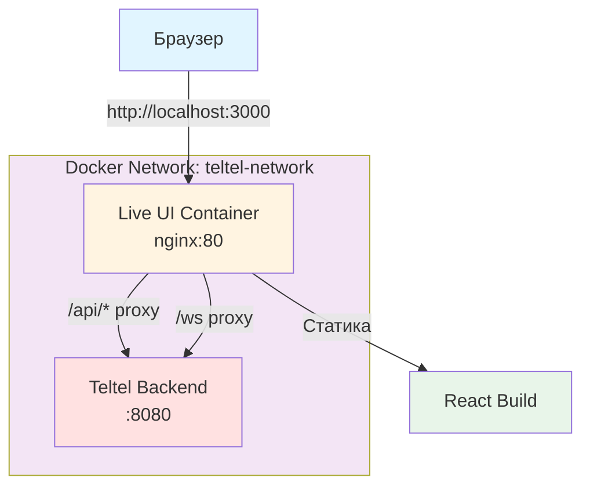

# Архитектура nginx proxy для Live UI v2

**Дата создания:** 2024  
**Версия:** 1.0  
**Статус:** ✅ Реализовано

## Обзор

Live UI v2 использует nginx как единую точку входа для всех запросов от браузера. Это устраняет проблемы CORS, упрощает конфигурацию и обеспечивает единообразие между dev и production окружениями.

## Архитектурные принципы

### 1. Единая точка входа

Все запросы от браузера идут через `http://localhost:3000` (единый origin):
- Статический контент (React build)
- HTTP API запросы (`/api/*`)
- WebSocket подключения (`/ws`)

### 2. Относительные пути

Live UI использует относительные пути для всех подключений:
- WebSocket: `/ws` (вместо `ws://localhost:8081/ws`)
- HTTP API: `/api/*` (вместо `http://localhost:8081/api/*`)

### 3. Прозрачное проксирование

nginx проксирует запросы к backend без изменения логики приложения:
- `/api/*` → `http://teltel:8080/api/*` (внутри Docker сети)
- `/ws` → `ws://teltel:8080/ws` (WebSocket upgrade)

## Архитектурная диаграмма

### Текущая архитектура (TO-BE)



**Преимущества:**
- ✅ Единый origin (нет CORS проблем)
- ✅ nginx как единая точка входа
- ✅ Backend доступен только внутри Docker сети
- ✅ Единообразие dev/prod окружений

### Поток запросов

```mermaid
sequenceDiagram
    participant Browser as Браузер
    participant Nginx as nginx (Live UI)
    participant React as React App
    participant Teltel as Teltel Backend
    
    Browser->>Nginx: GET / (index.html)
    Nginx->>Browser: React Build
    
    Browser->>Nginx: GET /api/analysis/runs
    Nginx->>Teltel: proxy_pass /api/analysis/runs
    Teltel->>Nginx: JSON response
    Nginx->>Browser: JSON response
    
    Browser->>Nginx: WS /ws (upgrade)
    Nginx->>Teltel: proxy_pass /ws (upgrade)
    Teltel->>Nginx: WebSocket connection
    Nginx->>Browser: WebSocket connection
    Browser<->>Teltel: WebSocket messages (через nginx)
```

## Конфигурация nginx

### Маршрутизация

nginx конфигурация (`live-ui/nginx.conf`) определяет следующие маршруты:

1. **`/health`** — health check endpoint для контейнера
   - Возвращает `200 OK` для проверки работоспособности

2. **`/ws`** — WebSocket proxy
   - Проксирует к `http://teltel:8080/ws`
   - Настраивает WebSocket upgrade заголовки
   - Длинные таймауты для long-lived connections (3600s)

3. **`/api/*`** — HTTP API proxy
   - Проксирует к `http://teltel:8080/api/*`
   - Стандартные proxy заголовки (Host, X-Real-IP, X-Forwarded-For)
   - Таймауты для HTTP запросов (60s)

4. **`/config.js`** — runtime конфигурация (legacy, может быть удалён)
   - Используется для генерации `window.__ENV__` (устарело после миграции)

5. **Статические ресурсы** — кэширование
   - JS, CSS, изображения с долгим кэшированием (1 год)
   - Immutable cache headers

6. **`/`** — SPA routing (fallback)
   - Все остальные пути возвращают `index.html` для SPA routing

### Ключевые директивы

#### WebSocket proxy

```nginx
location /ws {
    proxy_pass http://teltel:8080/ws;
    proxy_http_version 1.1;
    
    # WebSocket upgrade заголовки
    proxy_set_header Upgrade $http_upgrade;
    proxy_set_header Connection "upgrade";
    
    # Proxy заголовки
    proxy_set_header Host $host;
    proxy_set_header X-Real-IP $remote_addr;
    proxy_set_header X-Forwarded-For $proxy_add_x_forwarded_for;
    proxy_set_header X-Forwarded-Proto $scheme;
    
    # Таймауты для long-lived connections
    proxy_read_timeout 3600s;
    proxy_send_timeout 3600s;
    proxy_connect_timeout 60s;
    
    # Отключаем буферизацию для WebSocket
    proxy_buffering off;
}
```

#### HTTP API proxy

```nginx
location /api/ {
    proxy_pass http://teltel:8080/api/;
    proxy_http_version 1.1;
    
    # Proxy заголовки
    proxy_set_header Host $host;
    proxy_set_header X-Real-IP $remote_addr;
    proxy_set_header X-Forwarded-For $proxy_add_x_forwarded_for;
    proxy_set_header X-Forwarded-Proto $scheme;
    
    # Таймауты
    proxy_read_timeout 60s;
    proxy_send_timeout 60s;
    proxy_connect_timeout 10s;
    
    # Буферизация для HTTP
    proxy_buffering on;
}
```

## Конфигурация Live UI

### Относительные пути

Live UI использует относительные пути для всех подключений:

#### WebSocket

```typescript
// src/utils/config.ts
export function getWebSocketUrl(): string {
  // Возвращает относительный путь /ws
  // Браузер автоматически использует текущий origin
  return '/ws';
}
```

#### HTTP API

```typescript
// src/data/analysis.ts
class AnalysisClient {
  // Использует относительные пути /api/analysis/*
  async getRuns(): Promise<Run[]> {
    const response = await fetch('/api/analysis/runs');
    return response.json();
  }
}
```

### Упрощение конфигурации

После миграции на относительные пути:
- ❌ Убрана зависимость от `VITE_WS_URL`
- ❌ Убрана runtime конфигурация через `config.js`
- ❌ Убрана логика преобразования `ws://` → `http://`
- ✅ Все пути относительные и работают одинаково в dev/prod

## Dev/Prod Parity

### Dev-режим (Vite dev server)

В dev-режиме Vite dev server проксирует запросы аналогично nginx:

```typescript
// vite.config.ts
export default defineConfig({
  server: {
    port: 3000,
    proxy: {
      '/api': {
        target: 'http://localhost:8080',
        changeOrigin: true,
      },
      '/ws': {
        target: 'ws://localhost:8080',
        ws: true,
        changeOrigin: true,
      },
    },
  },
});
```

**Преимущества:**
- Одинаковые относительные пути в коде
- Одинаковое поведение в dev и prod
- Нет необходимости в разных конфигурациях

### Production (nginx)

В production nginx проксирует запросы к backend внутри Docker сети:

```nginx
# /api/* → http://teltel:8080/api/*
# /ws → ws://teltel:8080/ws
```

**Преимущества:**
- Backend доступен только внутри Docker сети
- Единая точка входа для браузера
- Нет CORS проблем

## Сетевая архитектура Docker

### Docker сеть

Все сервисы общаются через Docker сеть `teltel-network`:

```
┌─────────────────────────────────────┐
│  Docker Network: teltel-network     │
│                                     │
│  ┌──────────────┐                  │
│  │   live-ui    │                  │
│  │  nginx:80    │                  │
│  └──────┬───────┘                  │
│         │                           │
│         │ /api/*, /ws               │
│         │                           │
│  ┌──────▼───────┐                  │
│  │    teltel    │                  │
│  │   :8080      │                  │
│  └──────────────┘                  │
│                                     │
└─────────────────────────────────────┘
         ▲
         │
         │ http://localhost:3000
         │
    ┌────┴────┐
    │ Browser │
    └─────────┘
```

### Порты

- **Внешние порты:**
  - `3000` → `live-ui:80` (единственная точка входа)
  - `8123` → `clickhouse:8123` (ClickHouse HTTP)

- **Внутренние порты (Docker сеть):**
  - `teltel:8080` — backend API (доступен только внутри сети)
  - `clickhouse:8123` — ClickHouse (доступен внутри сети)

### Безопасность

- Backend (`teltel`) не имеет внешних портов
- Все запросы идут через nginx proxy
- Единый origin для браузера (нет CORS)
- Изоляция backend внутри Docker сети

## API Endpoints

### Проксируемые endpoints

Все следующие endpoints доступны через nginx proxy на `http://localhost:3000/api/*`:

#### Ingest API
- `POST /api/ingest` — приём телеметрии

#### Runs API
- `GET /api/runs` — список run'ов
- `GET /api/run?runId={id}` — информация о run'е

#### Analysis API
- `GET /api/analysis/runs` — список run'ов для анализа
- `GET /api/analysis/run/{runId}` — данные run'а
- `GET /api/analysis/series` — временные ряды
- `POST /api/analysis/compare` — сравнение run'ов
- `POST /api/analysis/query` — произвольные запросы

#### Health API
- `GET /api/health` — health check backend

#### WebSocket
- `WS /ws` — WebSocket подключение для live данных

## Миграция с абсолютных путей

### До миграции (AS-IS)

```typescript
// Абсолютные URL
const wsUrl = 'ws://localhost:8081/ws';
const apiUrl = 'http://localhost:8081/api';
```

**Проблемы:**
- CORS ошибки (разные origin)
- Зависимость от внешнего порта backend
- Разные конфигурации для dev/prod

### После миграции (TO-BE)

```typescript
// Относительные пути
const wsUrl = '/ws';
const apiUrl = '/api';
```

**Преимущества:**
- Нет CORS проблем (единый origin)
- Не зависит от портов
- Единая конфигурация для dev/prod

## Troubleshooting

### WebSocket не подключается

**Проблема:** WebSocket подключение не устанавливается

**Проверка:**
1. Проверить, что backend запущен: `docker-compose ps`
2. Проверить nginx конфигурацию: `docker-compose exec live-ui cat /etc/nginx/conf.d/default.conf`
3. Проверить логи: `docker-compose logs live-ui`
4. Проверить WebSocket через curl: `curl -i -N -H "Connection: Upgrade" -H "Upgrade: websocket" http://localhost:3000/ws`

**Решение:**
- Убедиться, что nginx конфигурация содержит правильные заголовки для WebSocket upgrade
- Проверить, что backend доступен внутри Docker сети: `docker-compose exec live-ui wget -q -O- http://teltel:8080/api/health`

### API запросы возвращают 502

**Проблема:** API запросы возвращают 502 Bad Gateway

**Проверка:**
1. Проверить, что backend здоров: `docker-compose ps`
2. Проверить доступность backend: `docker-compose exec live-ui wget -q -O- http://teltel:8080/api/health`
3. Проверить логи nginx: `docker-compose logs live-ui`

**Решение:**
- Убедиться, что backend запущен и здоров
- Проверить сетевую конфигурацию Docker: `docker network inspect teltel-network`

### CORS ошибки

**Проблема:** CORS ошибки в браузере

**Причина:** После миграции на nginx proxy CORS ошибок быть не должно (единый origin)

**Решение:**
- Убедиться, что все запросы идут через относительные пути (`/api/*`, `/ws`)
- Проверить, что нет прямых обращений к `localhost:8081`
- Проверить консоль браузера на наличие абсолютных URL

## Следующие шаги

После завершения миграции на nginx proxy:

1. ✅ Убрать `VITE_WS_URL` из всех конфигураций
2. ✅ Упростить конфигурацию Live UI
3. ✅ Обеспечить dev/prod parity
4. ✅ Документировать архитектуру

**Статус:** ✅ Все этапы завершены

## Ссылки

- [Roadmap: nginx proxy и fetch API](../../.cursor/plans/nginx_proxy_и_fetch_api_roadmap_530f1365.plan.md)
- [DOCKER.md](../../DOCKER.md) — Docker окружение
- [README.md](./README.md) — Live UI документация
